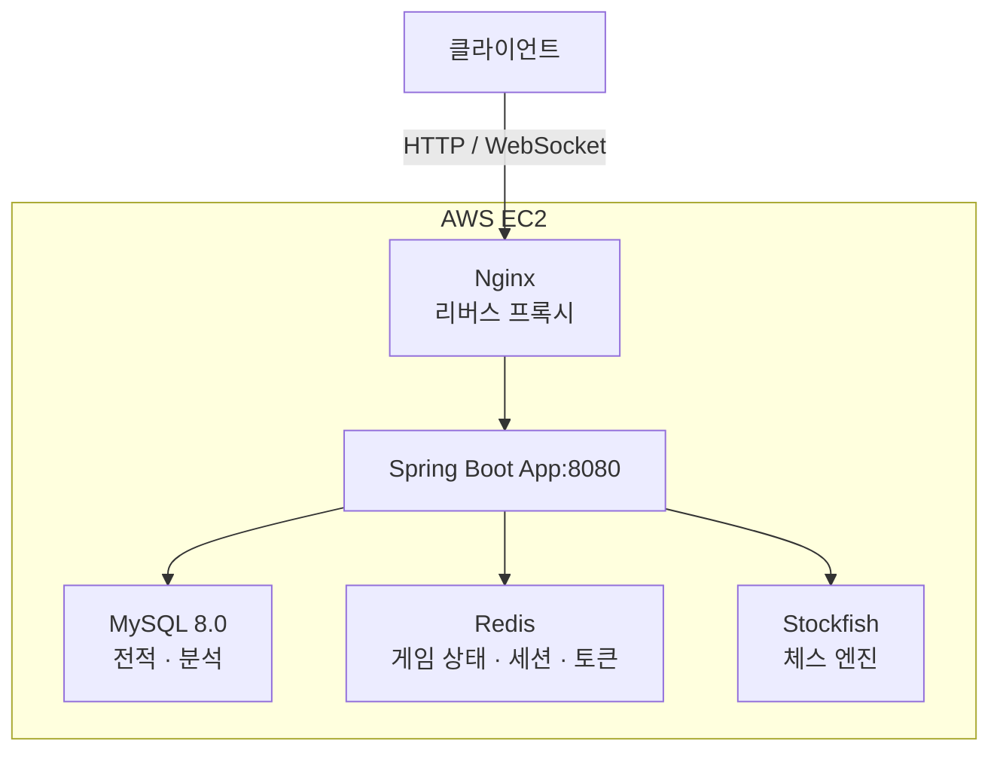
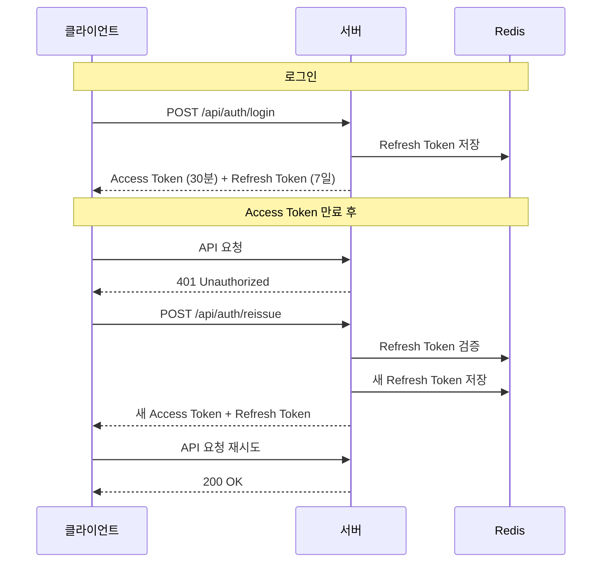

# 시스템 아키텍처
## 전체 구조

클라이언트의 HTTP 요청과 WebSocket 연결은 Nginx를 통해 Spring Boot 애플리케이션으로 전달됩니다.



모든 서비스는 AWS EC2 단일 인스턴스에서 Docker Compose로 실행됩니다.

```
EC2
|-- app
|-- mysql
|-- redis
|-- nginx
```

<br>

## 데이터 저장 전략

속도가 중요한 임시 데이터는 Redis에, 영구 보존이 필요한 데이터는 MySQL에 저장합니다.

### Redis

| 키                 | 용도                                 | TTL |
|-------------------|------------------------------------|----|
| `game:{gameId}`   | 진행 중인 게임 상태<br/>(FEN, 수 목록, 타이머 등) |24시간|
| `guest:{guestId}` | 비로그인 게스트 세션                        |1시간|
| `invite:{code}`   | 친구 초대 코드                           | 10분|
| `refresh:{email}` | Refresh Token                      | 7일 |

### MySQL

[ERD 다이어그램 - erdcloud](https://www.erdcloud.com/d/abQb5XBL5J66dCqkc)

| 테이블          | 용도              |
|--------------|-----------------|
| `users`      | 회원 정보           |
| `game_record` | 게임 전적 (PGN, 결과) |
| `analysis`   | 게임 분석 결과        |

<br>

## 인증 구조

**로그인 사용자**는 JWT Access Token / Refresh Token 방식을 사용합니다. 
Access Token은 30분, Refresh Token은 7일의 유효기간을 가지며 만료 시 재발급 API를 통해 갱신합니다.

**비로그인 게스트**는 서버에서 UUID를 발급받아 Redis에 저장합니다. 
이후 WebSocket 연결 시 `GuestId` 헤더로 인증합니다.



<br>

## WebSocket 구조
STOMP 프로토콜을 사용하며 구독/발행 구조로 동작합니다.

클라이언트가 구독하는 채널
- `/topic/game/{gameId}` - 게임 이벤트 브로드캐스트 (각 수, 게임 종료 등)
- `/user/queue/match` - 랜덤 매칭 결과
- `/user/queue/invite/matched` - 초대 코드 매칭 결과
- `/user/queue/computer` - 컴퓨터 대전 시작

클라이언트가 발행하는 엔드포인트
- `/app/match/join`, `/app/match/cancel` - 랜덤 매칭 참가/취소
- `/app/game/{gameId}/ready` - 게임 준비 완료
- `/app/game/{gameId}/move` - 수 두기
- `/app/game/{gameId}/resign` - 기권
- `/app/game/{gameId}/draw` - 무승부 제안/수락/거절
- `/app/game/{gameId}/start` - 컴퓨터 대전 시작

<br>

## CI/CD
GitHub Actions를 통해 `main` 브랜치에 push 시 자동 배포됩니다.
